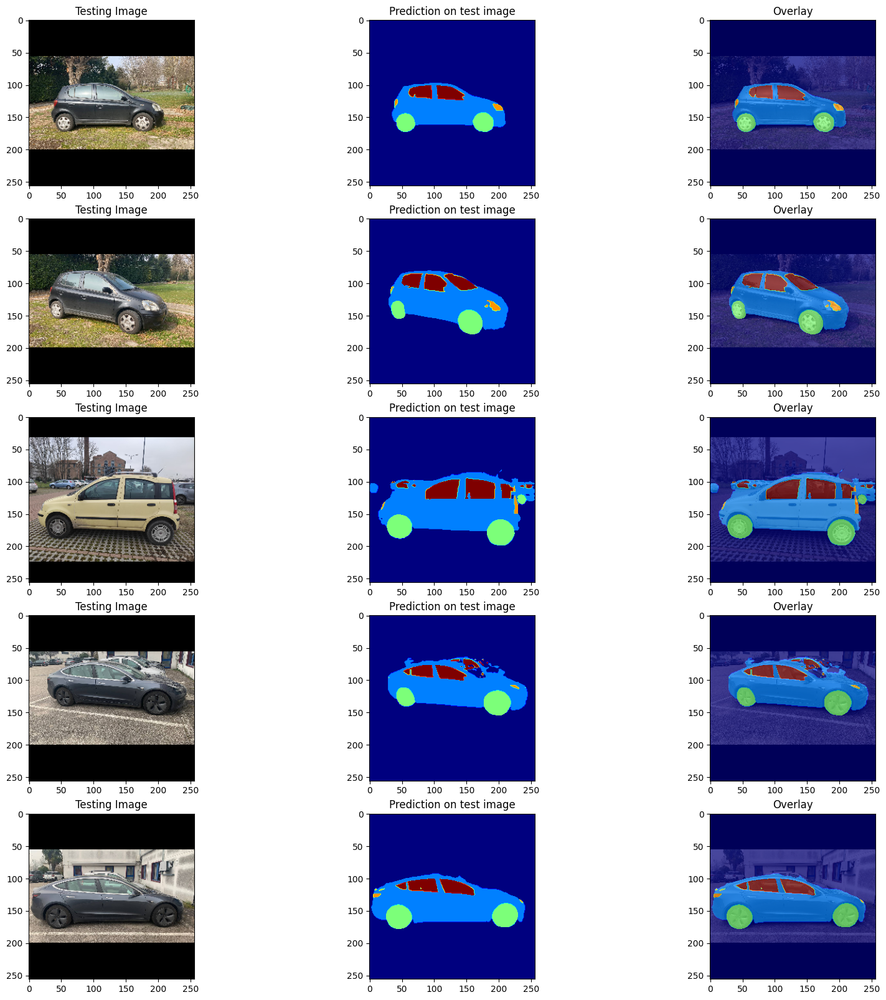

# Semantic Car Segmentation with Deep Learning Models

This project explores the application of various deep learning architectures for semantic segmentation of car images. It includes the implementation, training, and evaluation of models like UNet, FPN, LinkNet, and PSPNet, utilizing different backbones and image resolutions to compare their performance.

## Project Overview

The primary goal is to accurately segment cars from images, identifying different parts across 5 distinct classes. The project systematically experiments with several state-of-the-art segmentation models to compare their performance on a dedicated car image dataset.

Key activities include:
*   Loading and preprocessing image and mask data at various resolutions (128x128, 144x144, 256x256).
*   Augmenting the dataset to improve model generalization.
*   Implementing and training multiple segmentation models using the `segmentation-models` library.
*   Evaluating model performance using metrics like IoU (Intersection over Union) and F1-Score.
*   Visually comparing prediction results across different architectures, backbones, and image input sizes.

## Implemented Models

The following models have been implemented, trained, and compared:

*   **UNet**:
    *   Trained on 128x128 images.
    *   The trained model is loaded from `UNet_segm.hdf5`.

*   **FPN (Feature Pyramid Network)**:
    *   With `vgg16` backbone, trained on 128x128 and 256x256 images.
    *   With `resnet34` backbone, trained on 128x128 images.
    *   Notebooks: FPN_VGG16_segm_original.ipynb, FPN_segm_aumentato.ipynb, FPN_VGG16_256.ipynb.

*   **LinkNet**:
    *   Employs a `resnet34` backbone.
    *   Trained on the augmented dataset with 128x128 images.
    *   Implementation can be found in LinkNet.ipynb.

*   **PSPNet (Pyramid Scene Parsing Network)**:
    *   Uses a `resnet34` backbone.
    *   Experiments were conducted with different image resolutions: 144x144 (`PSPNet_144x144.ipynb`) and 192x192 (`PSPNet_192x192.ipynb`).

## Dataset

The project uses a car image dataset with corresponding segmentation masks. The dataset consists of 5 classes.

### Data Augmentation

To enhance the dataset and improve model robustness, various data augmentation techniques were applied. The notebook dataAugmentation.ipynb implements the following transformations:
*   Horizontal Mirroring
*   Gaussian Noise
*   Color Jittering
*   Blur
*   Random Rotations

### Final Results
Final IoU score reached is about 89%
We also applied the best model (FPN) to our cars.

## Workspace Structure

The repository is organized into several Jupyter notebooks, each dedicated to a specific model or task.

*   `UNet_*.ipynb`, `FPN_*.ipynb`, LinkNet.ipynb, `PSPNet_*.ipynb`: Notebooks for training specific models.
*   dataAugmentation.ipynb: Contains the code for data augmentation.
*   confronto_risultati_dataset.ipynb: Used for loading all trained models and visually comparing their prediction results on the test set.
*   `*.log`: Log files generated during model training, containing metrics for each epoch.
*   `*.hdf5`: Saved model weights after training.
*   Esercizi_Lezione: A directory containing notebooks with exercises on fundamental deep learning concepts.

## Setup and Dependencies

This project is built using Python and relies on several deep learning and computer vision libraries.

### Main Dependencies
*   TensorFlow / Keras
*   `segmentation-models`
*   OpenCV-Python
*   Scikit-learn
*   NumPy
*   Matplotlib

